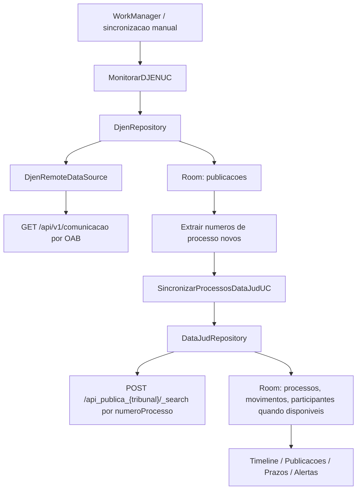

# Plano de implementacao CNJ - ObiterJus

Data de referencia: 2026-04-29

Este documento transforma a arquitetura do ObiterJus em um roteiro de construcao incremental, com foco em robustez na ingestao de publicacoes do DJEN, enriquecimento via DataJud, persistencia local e seguranca operacional.

## 1. Decisao de arquitetura ajustada

O fluxo de dados deve partir do DJEN, nao do DataJud.

O DataJud nao deve ser tratado como fonte para descobrir todos os processos de um advogado por OAB. A estrategia robusta e:

1. `MonitorarDJENUC` consulta publicacoes por OAB no endpoint de comunicacoes.
2. O app extrai os `numero_processo` novos encontrados nas publicacoes.
3. Para cada processo novo ou desatualizado, o app consulta o DataJud por numero processual.
4. O DataJud enriquece a base local com classe, tribunal, grau, orgao julgador, assuntos e movimentacoes.
5. A UI sempre mostra fonte, data da ultima sincronizacao e nivel de confianca da informacao.

Nota sobre partes: na API publica do DataJud, dados de partes/participantes nao devem ser assumidos como disponiveis. Quando existirem no payload, podem ser salvos. Quando nao existirem, o app deve usar apenas os destinatarios/advogados vindos do DJEN e deixar claro que a capa publica esta incompleta.

Fluxo principal:



## 2. Escopo do MVP confiavel

O primeiro marco deve entregar monitoramento, armazenamento e visualizacao confiaveis, antes de automatizar prazos.

Inclui:

- Cadastro local de OAB: numero, UF, nome do advogado e intervalo inicial de busca.
- Busca manual e periodica no DJEN.
- Persistencia local de publicacoes.
- Deteccao de publicacoes novas.
- Enriquecimento de processos via DataJud por numero processual.
- Armazenamento de participantes apenas quando vierem de fonte publica disponivel.
- Timeline basica por processo.
- Tela de publicacoes com filtros por data, tribunal, tipo e sigilo.
- Indicadores de fonte e ultima sincronizacao.

Nao inclui no primeiro marco:

- Calculo automatico definitivo de prazos.
- Criacao automatica em Google/Outlook Calendar.
- IA/NLP externa.
- Sincronizacao multi-dispositivo.
- Integracao protegida com Domicilio Judicial Eletronico.

## 3. Pacotes sugeridos

Estrutura alvo:

```text
com.obiterjus
  core
    config
    database
    network
    parser
    time
    worker
  data
    djen
      remote
      local
      mapper
      repository
    datajud
      remote
      local
      mapper
      repository
    processo
    publicacao
  domain
    model
    repository
    usecase
  presentation
    app
    publicacoes
    processos
    timeline
    settings
```

Regra: a camada `domain` nao conhece Retrofit, Room, Remote Config, Android `Html` ou detalhes de JSON.

## 4. Dependencias tecnicas

Adicionar gradualmente:

- Jetpack Compose e Material 3.
- Hilt para injecao de dependencias.
- Retrofit + OkHttp.
- Kotlinx Serialization ou Moshi.
- Room.
- DataStore Preferences.
- WorkManager.
- Firebase Remote Config.
- Firebase Analytics/Crashlytics, quando o projeto Firebase estiver criado.

Preferencia sugerida: Kotlinx Serialization, porque o projeto e Kotlin-first. Se os DTOs ficarem muito irregulares, Moshi tambem e adequado.

## 5. Configuracao remota e seguranca

Remote Config deve carregar:

- `djen_base_url`
- `datajud_base_url`
- `datajud_api_key`
- `djen_default_items_per_page`
- `sync_lookback_days`
- `datajud_enabled`
- `djen_enabled`
- `request_timeout_seconds`

Observacao importante: Remote Config melhora rotacao e operacionalidade, mas nao torna segredo inviolavel no cliente. Para uma chave publica do DataJud, isso e aceitavel como camada de resiliencia. Para credenciais sensiveis, como Domicilio Judicial Eletronico ou chaves privadas de backend, usar backend proprio ou Cloud Functions.

Padriao recomendado:

1. App inicia com valores fallback seguros no codigo.
2. App faz fetch do Remote Config.
3. Se falhar, usa fallback/cache anterior e marca `configSource = Cached/Fallback`.
4. Backend leve ou script agendado valida endpoints/chaves e atualiza Remote Config via Firebase Admin SDK.
5. Nunca colocar credenciais server-to-server dentro do APK.

## 6. Contratos remotos

### 6.1 DJEN

Endpoint testado:

```text
GET https://comunicaapi.pje.jus.br/api/v1/comunicacao
```

Parametros:

- `numeroOab`
- `ufOab`
- `dataDisponibilizacaoInicio`
- `dataDisponibilizacaoFim`
- `pagina`
- `itensPorPagina`

Nao usar `page` e `size` para essa rota, pois foram ignorados no teste real.

DTO minimo:

```kotlin
@Serializable
data class DjenResponseDto(
    val status: String? = null,
    val message: String? = null,
    val count: Int? = null,
    val items: List<DjenComunicacaoDto> = emptyList()
)

@Serializable
data class DjenComunicacaoDto(
    val id: Long,
    @SerialName("data_disponibilizacao")
    val dataDisponibilizacaoIso: String? = null,
    val siglaTribunal: String? = null,
    val tipoComunicacao: String? = null,
    val nomeOrgao: String? = null,
    val idOrgao: Long? = null,
    val texto: String? = null,
    @SerialName("numero_processo")
    val numeroProcesso: String? = null,
    val meio: String? = null,
    val link: String? = null,
    val tipoDocumento: String? = null,
    val nomeClasse: String? = null,
    val codigoClasse: String? = null,
    val numeroComunicacao: Long? = null,
    val ativo: Boolean? = null,
    val hash: String? = null,
    val status: String? = null,
    val motivo_cancelamento: String? = null,
    val data_cancelamento: String? = null,
    val datadisponibilizacao: String? = null,
    val meiocompleto: String? = null,
    val numeroprocessocommascara: String? = null,
    val destinatarios: List<DjenDestinatarioDto> = emptyList(),
    val destinatarioadvogados: List<DjenAdvogadoDestinatarioDto> = emptyList()
)
```

Regra de paginação:

```text
pagina = 1
itensPorPagina = 100
loop enquanto items nao vazio
parar se pagina exceder limite defensivo ou se count total ja tiver sido consumido
```

Defesas:

- Se a API retornar menos itens que `itensPorPagina`, encerrar.
- Se `items` vier vazio, encerrar.
- Se `count` vier nulo ou incoerente, confiar no array.
- Se a mesma pagina repetir IDs da pagina anterior, encerrar e registrar erro de paginacao.

### 6.2 Certidao DJEN

Endpoint observado:

```text
GET /api/v1/comunicacao/{hash}/certidao
```

Retorno:

- `application/pdf`
- deve ser salvo como arquivo/cache apenas sob demanda.

### 6.3 DataJud

Endpoint por tribunal:

```text
POST https://api-publica.datajud.cnj.jus.br/api_publica_tjmg/_search
Authorization: APIKey {chave}
Content-Type: application/json
```

Consulta por processo:

```json
{
  "size": 1,
  "query": {
    "match": {
      "numeroProcesso": "50110879520258130245"
    }
  }
}
```

DTO minimo:

```kotlin
@Serializable
data class DataJudSearchResponseDto(
    val took: Int? = null,
    @SerialName("timed_out")
    val timedOut: Boolean? = null,
    val hits: DataJudHitsDto? = null
)

@Serializable
data class DataJudHitsDto(
    val total: DataJudTotalDto? = null,
    val hits: List<DataJudHitDto> = emptyList()
)

@Serializable
data class DataJudHitDto(
    @SerialName("_index")
    val index: String? = null,
    @SerialName("_id")
    val id: String? = null,
    @SerialName("_score")
    val score: Double? = null,
    @SerialName("_source")
    val source: DataJudProcessoDto? = null,
    val sort: List<JsonElement>? = null
)
```

Para buscas amplas por tribunal, usar `sort` + `search_after`. Para a consulta pontual por `numeroProcesso`, `size = 1` costuma bastar.

Participantes/partes:

- Nao tratar como campo obrigatorio.
- Se o DataJud retornar participantes em algum tribunal/indice, mapear de forma opcional.
- Se nao retornar, nao tentar inferir partes a partir de texto livre.
- O DJEN pode fornecer `destinatarios` e `destinatarioadvogados`; esses dados devem ficar vinculados a publicacao, nao necessariamente como capa processual definitiva.

## 7. Parse defensivo

Criar utilitarios em `core.parser`:

```text
CnjDateParser
DjenTextCleaner
NumeroProcessoNormalizer
SigiloDetector
```

### 7.1 Datas

Aceitar:

- ISO com timezone: `2026-04-02T05:01:47.757000Z`
- Data simples: `2026-04-20`
- Data brasileira: `20/04/2026`
- Compacta DataJud: `20260219143412`
- Nulo ou string vazia.

Saida:

- `Instant?` para data-hora.
- `LocalDate?` para data de disponibilizacao.
- Nunca quebrar o parser por data inesperada; registrar erro de parse e manter campo bruto.

### 7.2 Texto DJEN

Pipeline:

1. Receber `textoRaw`.
2. Se contiver tags HTML, usar `Html.fromHtml(textoRaw, Html.FROM_HTML_MODE_LEGACY).toString()`.
3. Normalizar espacos e quebras de linha.
4. Preservar uma copia do texto bruto para auditoria.
5. Detectar mensagens de template/erro sem impedir salvamento.
6. Detectar sigilo antes de aplicar highlight.

Campos locais:

```text
textoRaw
textoLimpo
textoPossuiHtml
textoPossuiErroTemplate
isSigiloso
```

Regra inicial de sigilo:

```text
isSigiloso = textoLimpo contem "Processo sob sigilo"
          ou textoLimpo contem "conforme legislacao aplicavel"
          ou nivelSigilo DataJud > 0
```

## 8. Modelo local Room

### 8.1 PublicacaoEntity

Campos:

- `id: Long`
- `hash: String?`
- `numeroProcesso: String?`
- `numeroProcessoFormatado: String?`
- `dataDisponibilizacao: LocalDate?`
- `tribunal: String?`
- `tipoComunicacao: String?`
- `tipoDocumento: String?`
- `nomeOrgao: String?`
- `textoRaw: String?`
- `textoLimpo: String?`
- `textoPossuiHtml: Boolean`
- `textoPossuiErroTemplate: Boolean`
- `isSigiloso: Boolean`
- `link: String?`
- `meio: String?`
- `meioCompleto: String?`
- `ativo: Boolean`
- `statusRemoto: String?`
- `motivoCancelamento: String?`
- `dataCancelamento: Instant?`
- `capturadoEm: Instant`
- `atualizadoEm: Instant`

Indices:

- unique `id`
- unique opcional `hash`
- index `numeroProcesso`
- index `dataDisponibilizacao`
- index `tribunal`
- index `isSigiloso`

### 8.2 ProcessoEntity

Campos:

- `numeroProcesso: String`
- `numeroProcessoFormatado: String?`
- `tribunal: String?`
- `grau: String?`
- `classeCodigo: Int?`
- `classeNome: String?`
- `sistemaNome: String?`
- `formatoNome: String?`
- `orgaoJulgadorCodigo: String?`
- `orgaoJulgadorNome: String?`
- `nivelSigilo: Int?`
- `dataAjuizamento: Instant?`
- `dataHoraUltimaAtualizacaoDataJud: Instant?`
- `ultimaConsultaDataJudEm: Instant?`
- `syncStatus: ProcessoSyncStatus`

### 8.3 MovimentoEntity

Campos:

- `idLocal: String` gerado por hash de `numeroProcesso + codigo + dataHora + nome`
- `numeroProcesso: String`
- `codigo: Int?`
- `nome: String?`
- `dataHora: Instant?`
- `orgaoJulgadorCodigo: String?`
- `orgaoJulgadorNome: String?`
- `complementosJson: String?`

Indice unico:

- `idLocal`

### 8.4 Relacionamentos futuros

- `PastaEntity`
- `TagEntity`
- `ProcessoTagCrossRef`
- `PublicacaoPrazoSugeridoEntity`
- `EventoCalendarioEntity`

## 9. Use cases

### 9.1 `MonitorarDJENUC`

Entrada:

- OAB cadastrada.
- Janela de data.
- Modo: manual ou background.

Passos:

1. Buscar Remote Config.
2. Consultar DJEN paginado.
3. Mapear DTOs com parse defensivo.
4. Salvar/upsert publicacoes no Room.
5. Identificar publicacoes novas por `id` ou `hash`.
6. Extrair `numeroProcesso` dos novos registros.
7. Disparar `SincronizarProcessosDataJudUC` para processos novos ou stale.
8. Retornar resumo: total remoto, novos, atualizados, sigilosos, falhas.

### 9.2 `SincronizarProcessosDataJudUC`

Entrada:

- Lista de numeros processuais.

Passos:

1. Normalizar numeros.
2. Agrupar por tribunal quando possivel.
3. Resolver alias DataJud: `TJMG -> api_publica_tjmg`, `STJ -> api_publica_stj`, etc.
4. Consultar DataJud por numero.
5. Salvar/upsert processo.
6. Substituir movimentos do processo em transacao, ou fazer diff por hash local.
7. Marcar processos nao encontrados com status apropriado.

### 9.3 `ObservarPublicacoesUC`

Fornece `Flow<List<Publicacao>>` com filtros.

### 9.4 `ObservarTimelineProcessoUC`

Combina:

- publicacoes do DJEN;
- movimentos do DataJud;
- prazos sugeridos no futuro.

### 9.5 `ClassificarPublicacaoUC`

Inicialmente regra local:

- sigilo;
- urgencia por palavras-chave;
- tipo de documento;
- possivel prazo.

IA fica como etapa posterior, com consentimento e politica clara de privacidade.

## 10. Background sync

Usar WorkManager:

- `DjenSyncWorker`: periodico, preferencialmente diario.
- `DataJudSyncWorker`: acionado apos DJEN e para revalidar processos acompanhados.
- `RemoteConfigRefreshWorker`: opcional.

Politicas:

- `ExistingPeriodicWorkPolicy.KEEP` para jobs recorrentes.
- Backoff exponencial.
- Respeitar rede disponivel.
- Registrar ultima execucao, falha e fonte.

Janela inicial:

- Primeira execucao: buscar de 16/05/2025 ate hoje, em fatias mensais para reduzir timeout.
- Execucoes seguintes: buscar dos ultimos `sync_lookback_days`, por padrao 7 a 15 dias, para capturar atrasos/correcoes.

## 11. Regras de UI

### Publicacoes

Mostrar:

- data de disponibilizacao;
- tribunal;
- tipo;
- numero do processo;
- orgao;
- texto limpo;
- status de sigilo;
- link externo;
- fonte e ultima sincronizacao.

Se `isSigiloso`:

- mostrar icone de cadeado;
- ocultar highlight;
- exibir mensagem curta;
- manter link para consulta oficial, se existir.

### Timeline

Separar visualmente:

- eventos DataJud;
- publicacoes DJEN;
- eventos locais do usuario;
- prazos sugeridos.

Cada item deve informar fonte e horario de captura.

### Prazos

Primeira versao deve dizer "prazo sugerido", nunca "prazo definitivo".

Mostrar:

- evento de origem;
- regra aplicada;
- data inicial;
- dias considerados;
- feriados/suspensoes considerados;
- botao de confirmacao pelo advogado.

## 12. Observabilidade

Criar logs estruturados locais:

- endpoint chamado;
- janela de datas;
- pagina;
- quantidade de itens;
- tempo de resposta;
- erro HTTP;
- erro de parse;
- status de Remote Config.

Em producao:

- Crashlytics para falhas.
- Analytics apenas com eventos tecnicos anonimizados.
- Nunca enviar texto de publicacao, nome de parte ou numero de processo para analytics.

## 13. Testes obrigatorios

### Unitarios

- `CnjDateParserTest`
- `DjenTextCleanerTest`
- `SigiloDetectorTest`
- `NumeroProcessoNormalizerTest`
- mappers DJEN;
- mappers DataJud;
- paginadores.

### Integracao local

- Retrofit com MockWebServer para DJEN.
- Retrofit com MockWebServer para DataJud.
- Room in-memory para repositories.

### Casos de fixture

Guardar JSONs anonimizados em `app/src/test/resources/fixtures`:

- DJEN texto puro.
- DJEN HTML.
- DJEN processo sigiloso.
- DJEN com erro de template.
- DataJud data ISO.
- DataJud data compacta.
- DataJud com movimentos e complementos.
- DataJud sem resultado.

## 14. Fases de implementacao

### Fase 0 - Fundacao do projeto

Objetivo: preparar o app para arquitetura moderna.

Tarefas:

- Migrar tela inicial para Compose.
- Configurar catalogo de dependencias.
- Adicionar Hilt.
- Adicionar Room.
- Adicionar Retrofit/OkHttp.
- Adicionar Kotlinx Serialization ou Moshi.
- Adicionar DataStore.
- Adicionar WorkManager.
- Criar pacotes base.

Aceite:

- App compila.
- `MainActivity` renderiza shell Compose.
- DI inicial funciona.

### Fase 1 - Contratos e parsers CNJ

Objetivo: dominar formatos instaveis antes de persistir.

Tarefas:

- Criar DTOs DJEN.
- Criar DTOs DataJud.
- Criar `CnjDateParser`.
- Criar `DjenTextCleaner`.
- Criar `SigiloDetector`.
- Criar testes unitarios com fixtures.

Aceite:

- Datas ISO, brasileiras e compactas passam nos testes.
- HTML vira texto legivel.
- Processo sob sigilo e detectado.
- JSON com campos ausentes nao quebra parser.

### Fase 2 - Banco local

Objetivo: persistir publicacoes e processos com seguranca.

Tarefas:

- Criar entities.
- Criar DAOs.
- Criar migrations desde a versao 1.
- Criar TypeConverters para datas e enums.
- Criar repositories locais.

Aceite:

- Upsert de publicacoes evita duplicidade.
- Movimentos sao persistidos por processo.
- Consultas por data/processo funcionam.

### Fase 3 - DJEN remoto

Objetivo: buscar publicacoes por OAB com paginacao correta.

Tarefas:

- Criar `DjenApi`.
- Criar `DjenRemoteDataSource`.
- Implementar loop `pagina` + `itensPorPagina`.
- Criar deteccao de pagina repetida.
- Mapear DTO para domain/local.
- Salvar resultados no Room.

Aceite:

- Busca manual por OAB retorna resumo.
- Novas publicacoes sao identificadas.
- Falha parcial nao apaga dados antigos.

### Fase 4 - DataJud remoto

Objetivo: enriquecer processos descobertos no DJEN.

Tarefas:

- Criar `DataJudApi`.
- Criar resolvedor de alias por tribunal.
- Criar header dinâmico `Authorization: APIKey`.
- Consultar processo por `numeroProcesso`.
- Persistir processo e movimentos.
- Implementar `search_after` para consultas futuras amplas.

Aceite:

- Processo encontrado no DJEN gera registro enriquecido.
- Movimentos aparecem na timeline.
- Data compacta nao quebra sincronizacao.

### Fase 5 - Configuracao remota

Objetivo: remover chaves e URLs rigidas do fluxo operacional.

Tarefas:

- Criar `RemoteConfigDataSource`.
- Criar `AppConfigRepository`.
- Definir defaults locais.
- Usar Remote Config em DJEN/DataJud.
- Criar estados: `Remote`, `Cached`, `Fallback`.

Aceite:

- App funciona sem rede usando defaults/cache.
- Mudanca de URL/chave no Firebase nao exige novo APK.

### Fase 6 - WorkManager

Objetivo: monitorar automaticamente.

Tarefas:

- Criar `DjenSyncWorker`.
- Criar `DataJudSyncWorker`.
- Criar agendamento nas configuracoes.
- Criar notificacao local para novas publicacoes.
- Registrar status de sincronizacao.

Aceite:

- Worker executa manualmente em debug.
- Worker nao duplica dados.
- UI mostra ultima sincronizacao.

### Fase 7 - UI MVP

Objetivo: tornar a base consultavel pelo advogado.

Tarefas:

- Tela de configuracao da OAB.
- Tela de publicacoes.
- Tela de detalhe da publicacao.
- Tela de processos.
- Timeline do processo.
- Estados vazios, erro, carregando e sucesso.

Aceite:

- Usuario cadastra OAB e executa primeira busca.
- Publicacoes aparecem com texto limpo.
- Sigilosas aparecem com cadeado.
- Processo abre timeline combinada.

### Fase 8 - Prazos sugeridos

Objetivo: adicionar inteligencia com cautela juridica.

Tarefas:

- Criar modelo de prazo sugerido.
- Criar regras iniciais por tipo de comunicacao/documento.
- Integrar feriados nacionais/estaduais.
- Permitir confirmacao manual.
- Preparar integracao futura com calendario.

Aceite:

- UI deixa claro que e sugestao.
- Advogado confirma antes de criar compromisso.
- Fundamento e regra aplicada ficam visiveis.

### Fase 9 - Calendarios e notificacoes avancadas

Objetivo: levar prazos confirmados para agenda.

Tarefas:

- OAuth Google Calendar.
- OAuth Microsoft Graph/Outlook.
- Criar eventos apenas apos confirmacao.
- Marcar eventos como gerados pelo app.
- Guardar ids externos para atualizar/cancelar.

Aceite:

- Evento confirmado aparece no calendario.
- Edicao/cancelamento local sincroniza.
- Falha de OAuth nao perde prazo local.

## 15. Riscos e mitigacoes

- API DJEN muda parametros: manter Remote Config, testes de contrato e camada isolada.
- DataJud defasado: mostrar ultima atualizacao e fonte.
- Texto incompleto/sigiloso: preservar texto bruto, sinalizar sigilo e evitar highlight.
- Chave DataJud rotacionada: Remote Config + script de atualizacao.
- Quotas/timeouts: paginacao defensiva, backoff e fatias por data.
- Responsabilidade juridica sobre prazos: sempre tratar como sugestao confirmavel.
- Privacidade: nao enviar dados processuais sensiveis para analytics ou IA sem consentimento.

## 16. Ordem recomendada para comecar

1. Fase 0: fundacao Compose/Hilt/Room/Retrofit.
2. Fase 1: parsers e fixtures reais anonimizadas.
3. Fase 2: banco local.
4. Fase 3: DJEN remoto e persistencia de publicacoes.
5. Fase 4: DataJud por processo.
6. Fase 5: configuracao remota.
7. Fase 7: UI MVP.
8. Fase 6: WorkManager.
9. Fase 8: prazos sugeridos.

Essa ordem reduz risco porque valida primeiro o dado real e so depois aumenta a automacao.
